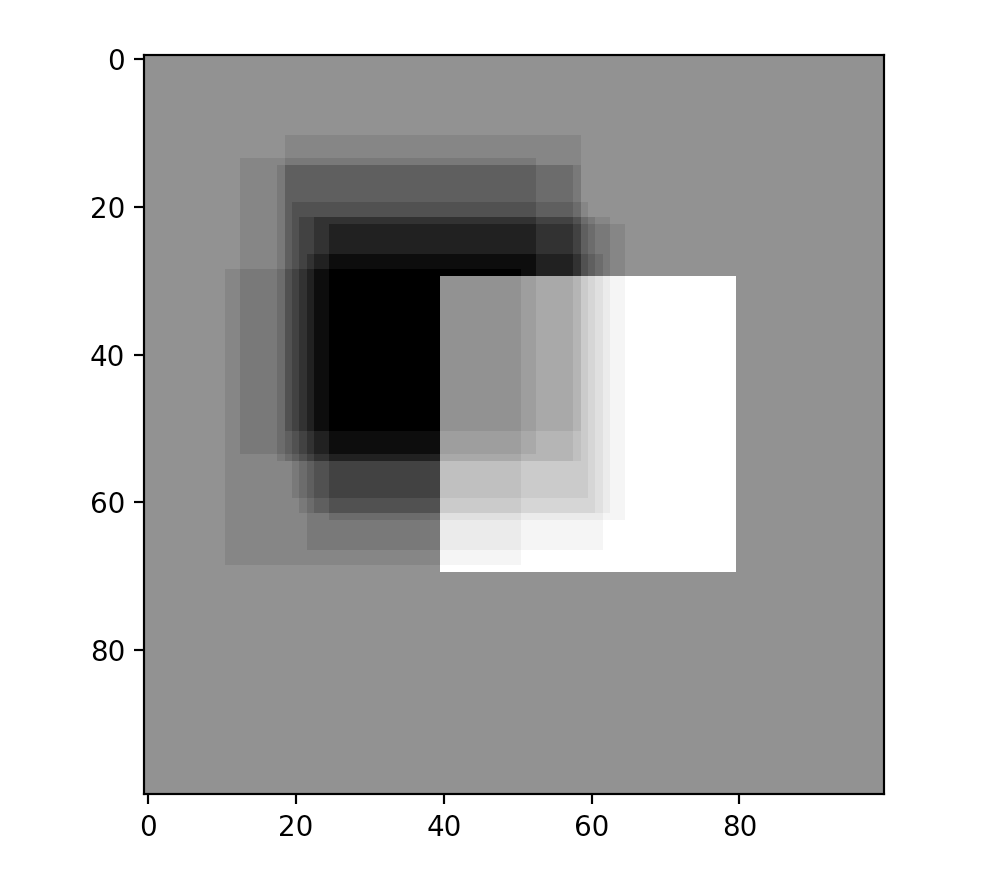
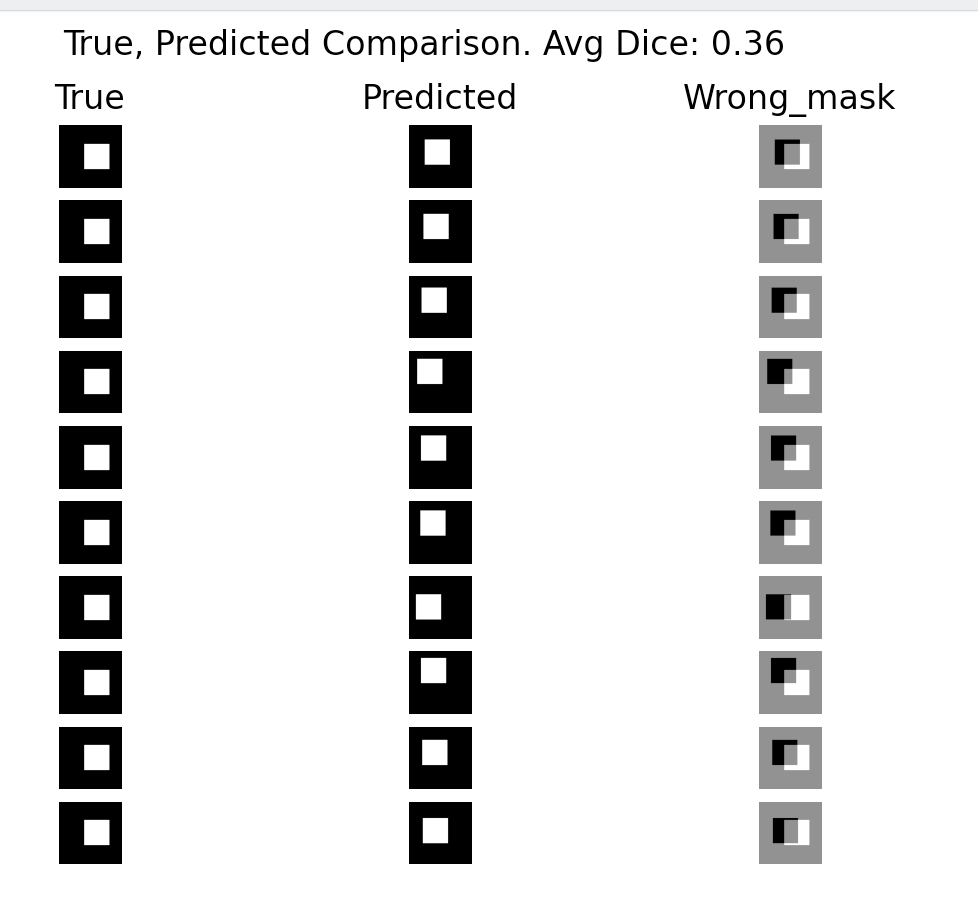

.. Predictions Analyzer documentation master file, created by
   sphinx-quickstart on Mon Jan 11 07:40:22 2021.
   You can adapt this file completely to your liking, but it should at least
   contain the root `toctree` directive.

Welcome to Predictions Analyzer's documentation!
================================================

To install

.. code-block::

  pip install predictions-analyzer

.. code-block:: python

  from predictions_analyzer.segmentation_analysis import analyze_preds_bias, show_many_wrongs_mask

segmentation_analysis Examples
====================

To make true_list and pred_list, start with an empty list and append

.. code-block:: python

   true_list = []
   pred_list = []

   for img in true_masks:
      true_list.append(img)

   for img in pred_masks:
      pred_list.append(img)

   analyze_preds_bias(true_list, pred_list)

Can be used to predict bias in predictions with analyze_preds_bias(true_list, pred_list)

Can also be used to analyze individual predictions with show_many_wrongs_mask(true_list, pred_list)

Segmentation Analysis
====================

.. automodule:: segmentation_analysis
   :members:

Tabular Analysis
====================
.. automodule:: tabular
   :members:

.. toctree::
   :maxdepth: 2
   :caption: Contents:

Indices and tables
===================

* :ref:`genindex`
* :ref:`modindex`
* :ref:`search`

